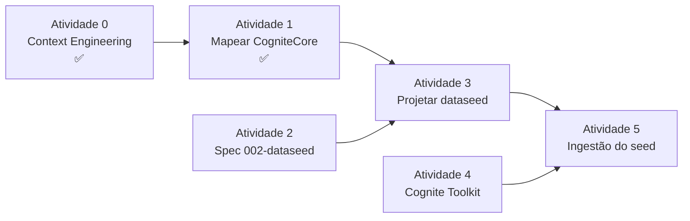

# Roadmap — 5 Atividades de Preparação

> **Rastreabilidade:** Este roadmap é complementado pela spec enabler
> [`specs/000-technical-foundation/`](../ipaper-checklist-management/specs/000-technical-foundation/) —
> lá estão o status detalhado de cada entrega, o `progress.md` e o `tasks.md`.

## Status atual (Jun 2026)

| Atividade | Status |
|---|---|
| Atividade 0 — Context engineering | ✅ **concluída** |
| Atividade 1 — Mapear CogniteCore | ✅ **concluída** |
| Atividade 2 — Spec 002-dataseed + renumeração | 🔲 pendente |
| Atividade 3 — Projetar e criar dataseed | 🔲 pendente (depende de 1 ✅) |
| Atividade 4 — Cognite Toolkit | 🔲 pendente |
| Atividade 5 — Ingestão do seed | 🔲 pendente (depende de 3 + 4) |

---

## Dependências entre atividades

---

## Atividade 0 — Context Engineering ✅ concluída

**Entregas:**
- `.cursor/rules/project-orientation.mdc` — Cursor Rule `alwaysApply: true` (mapa de orientação)
- `.cursor/rules/architecture.mdc` — Cursor Rule `alwaysApply: true` (regras de camada)
- `SPEC.md` — produto, personas, FRs e data models preenchidos (era vazio)
- `AGENTS.md` / `CLAUDE.md` — seções de arquitetura e data models adicionadas
- `docs/architecture/` — README, folder-structure, layers, ADR 0001
- `specs/000-technical-foundation/` — spec enabler que rastreia toda a fundação

---

## Atividade 1 — Mapear CogniteCore (`cdf_cdm` / `v1`) ✅ concluída

**Entregas:**
- `docs/datamodel.md` — CogniteCore v1 adicionado ao mesmo arquivo que `ApmAppData v13`
  (33 views, 7 detalhadas, tabela de compatibilidade `cdf_core` ↔ `cdf_cdm`)
- **Não** criado `docs/cognitecoremodel.md` separado — decisão de unificar em `datamodel.md`
- Referências atualizadas em: `AGENTS.md`, `CLAUDE.md`, `docs/README.md`,
  `specs/CONSTITUTION.md`, `docs/SDD-workflow-definition/sdd-governance.md`, `docs/mcp-cdf.md`

---

## Atividade 2 — Criar `specs/002-dataseed` (renumerar 002→003, 003→004, 004→005)

**O que fazer**
- Renomear pastas físicas: `002-checklist-kpis` → `003-checklist-kpis`, etc.
- Atualizar [`specs/README.md`](../ipaper-checklist-management/specs/README.md) com a nova numeração.
- Criar `specs/002-dataseed/` com os 5 arquivos SDD (`spec.md`, `progress.md`, `plan.md`, `tasks.md`, `research.md`).
- O `spec.md` deve cobrir:
  - **Objetivo:** gerar dados realistas de inspeção de linha para popular o ambiente `radix-dev`.
  - **Fonte:** `docs/Seed/A Line OEC Routes 2 (1).xlsx` (rotas OEC — "A Line").
  - **Decisão de DM** (a definir em Atividade 3): ApmAppData as-is / views estendidas / DM solution próprio.
  - **Formato de saída:** CSV ou Parquet (decidir com base no volume).
  - **Ferramenta de ingestão:** Cognite Toolkit (instalado na Atividade 4).

---

## Atividade 3 — Projetar e criar o dataseed

**O que fazer**

**3a — Analisar o Excel**
- Ler `docs/Seed/A Line OEC Routes 2 (1).xlsx` para entender rotas, equipamentos, tarefas e frequências.
- Mapear cada coluna para uma view do data model.

**3b — Decidir a arquitetura do DM** (3 opções a avaliar):

| Opção | Quando escolher |
|---|---|
| **ApmAppData as-is** | Os campos existentes em `Checklist v7`, `Template v8`, `TemplateItem v7`, `Schedule v4` cobrem tudo do Excel sem adaptação |
| **Views estendidas** | Existem ≤ 3 propriedades extras não cobertas; vale criar view `IpChecklistItem` estendendo `ChecklistItem v7` |
| **DM solution próprio** (`ip_checklist_dm`)| O Excel traz entidades novas (ex.: "Rota", "Ponto de inspeção") sem equivalente no APM; importa-se `CogniteAsset` do Core DM e `Template` do APM via referência |

**Critério de desempate:** preferir reutilizar ApmAppData; criar DM solution apenas se precisar de ≥ 2 entidades novas sem mapeamento direto.

**3c — Criar os arquivos de seed**
- Gerar CSVs/Parquets por view (ex.: `seed-templates.csv`, `seed-checklist-items.csv`, `seed-schedules.csv`).
- Um nó por linha, com `externalId` consistente e relacionamentos por referência direta.
- Salvar em `docs/Seed/` junto ao Excel original.

---

## Atividade 4 — Instalar, configurar e documentar o Cognite Toolkit

**O que fazer**
- Instalar: `npm install -g @cognite/toolkit` (ou via `npx @cognite/cdf-cli`).
- Autenticar contra o ambiente `radix-dev` usando as credenciais do `.env`.
- Validar com `cdf-tk status` ou equivalente.
- Criar `docs/cognite-toolkit.md` com:
  - Instalação e versão usada
  - Comandos de deploy de data model
  - Comandos de ingestão de instâncias (nodes/edges)
  - Exemplos de uso para este projeto

---

## Atividade 5 — Ingestão do seed no CDF

**O que fazer**
- Usar Cognite Toolkit para fazer upload dos CSVs/Parquets gerados na Atividade 3.
- Validar no ambiente `radix-dev`: consultar instâncias via MCP `cdf_list_instances` e confirmar que os nodes aparecem.
- Registrar evidências (contagens) em `specs/002-dataseed/progress.md`.

---

## Ordem de execução sugerida

1. ~~**Atividade 0**~~ ✅
2. ~~**Atividade 1**~~ ✅
3. **Atividade 2** — criar spec 002-dataseed + renumerar (rápido, não bloqueia nada)
4. **Atividade 4** — instalar Cognite Toolkit (independente, pode ser paralelo a 2)
5. **Atividade 3** — projetar dataseed (depende de 1 ✅)
6. **Atividade 5** — ingestão (depende de 3 e 4)

---

## Arquivos que serão criados/modificados (pendentes)

- `specs/002-dataseed/` — 5 novos arquivos SDD (Atividade 2)
- `specs/002-checklist-kpis/` → `specs/003-checklist-kpis/` — renomeado (Atividade 2)
- `specs/003-task-result-dashboards/` → `specs/004-task-result-dashboards/` — renomeado (Atividade 2)
- `specs/004-alerts-notifications/` → `specs/005-alerts-notifications/` — renomeado (Atividade 2)
- `specs/README.md` — atualizado (Atividade 2)
- `docs/Seed/*.csv` ou `docs/Seed/*.parquet` — novos arquivos de seed (Atividade 3)
- `docs/cognite-toolkit.md` — novo (Atividade 4)
