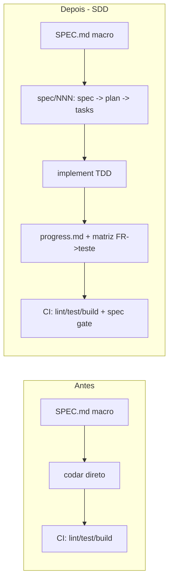
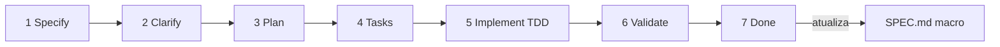
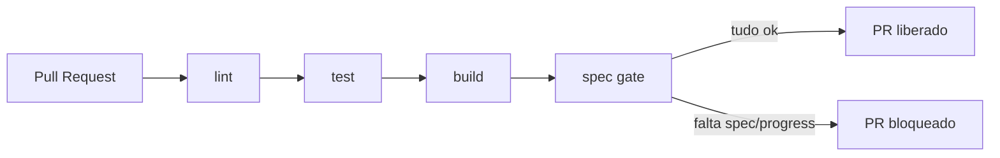

# Proposta: Spec Driven Development (SDD) — `ipaper-checklist-management`

> Documento para avaliação e discussão do time. Nada aqui foi implementado ainda.
> Objetivo: decidir **se** e **como** adotamos um fluxo de desenvolvimento guiado por especificação.

- **Autor:** João Hermida
- **Status:** rascunho para discussão
- **Última atualização:** 2026-06-02

---

## 1. Contexto e motivação

O projeto já tem uma base sólida de padrões, mas eles estão centrados em um único `SPEC.md` macro e em regras textuais no `AGENTS.md`. Não existe hoje:

- uma forma padronizada de especificar **cada feature** antes de codar;
- rastreamento do **andamento por etapa** de cada feature;
- ligação explícita entre **requisito → teste** (rastreabilidade);
- uma verificação automática que garanta que **código novo tem especificação**.

A proposta adiciona uma **camada de execução rastreável por feature** (Spec Driven Development), **sem remover** nada do que já existe.

### O que já existe (permanece intacto)

| Artefato | Papel atual |
| --- | --- |
| `SPEC.md` (raiz) | Spec macro do produto (visão, personas, requisitos globais, modelo de dados CDF) |
| `AGENTS.md` | Padrões de engenharia (Test-First, DI, ViewModel, regras TS, Conventional Commits) |
| `CLAUDE.md` | Aponta para o `AGENTS.md` |
| `.github/workflows/ci.yml` | Pipeline `lint → test → build` |
| `.agents/skills/...` | Skills do fluxo de certificação Flows |

### Antes x depois



---

## 2. Modelo híbrido de specs

Dois níveis convivem:

- **Macro (já existe):** `SPEC.md` na raiz = visão do produto.
- **Por feature (novo):** pasta `spec/` com uma subpasta por funcionalidade.

```
spec/
  README.md            # índice + status global de todas as features
  CONSTITUTION.md      # princípios invioláveis + Definition of Ready/Done
  _templates/          # modelos reutilizáveis
    spec.md
    plan.md
    tasks.md
    research.md
    progress.md
  001-<slug>/          # uma feature
    spec.md            # O QUÊ / PORQUÊ
    plan.md            # COMO (arquitetura)
    tasks.md           # decomposição em tarefas
    research.md        # decisões (ADRs) e dúvidas resolvidas
    progress.md        # andamento das 7 etapas
```

Convenção alinhada ao GitHub Spec Kit já citado no `SPEC.md` (`specs/<NNN>-<feature>/`), usando `spec/` por preferência do time.

---

## 3. Os 5 artefatos de cada feature

| Arquivo | Conteúdo | Responde |
| --- | --- | --- |
| `spec.md` | User stories, requisitos `FR-001…`, cenários de aceite, critérios de sucesso `SC-001…` | O QUÊ / PORQUÊ |
| `plan.md` | Desenho técnico (interfaces §4, DI §3, ViewModel §5, estado host-synced §2, trade-offs) | COMO |
| `tasks.md` | Tarefas pequenas e buildáveis, ordem Test-First (§6), cada uma citando o `FR` | EM QUE ORDEM |
| `research.md` | ADRs curtos (contexto → decisão → consequência) e clarificações resolvidas | POR QUE assim |
| `progress.md` | Andamento das 7 etapas + matriz de rastreabilidade | ONDE ESTAMOS |

> As referências `§2…§6` são as seções do `AGENTS.md`. O SDD não cria padrões novos de código; ele **amarra** os já existentes a cada etapa.

---

## 4. As 7 etapas do ciclo (e seus gates)



Cada etapa só "fecha" quando satisfaz um **gate** (critério objetivo):

| # | Etapa | Artefato | Gate (critério para fechar) |
| --- | --- | --- | --- |
| 1 | Specify | `spec.md` | Sem placeholders `<!-- -->`; todo `FR` é testável |
| 2 | Clarify | `research.md` | Nenhuma pergunta aberta marcada como bloqueante |
| 3 | Plan | `plan.md` | Cada `FR` mapeado a um componente/serviço |
| 4 | Tasks | `tasks.md` | Cada tarefa cita um `FR` e tem teste previsto |
| 5 | Implement | código + testes | `lint` + `test` + `build` verdes; sem `any`/`as` |
| 6 | Validate | cobertura + reviews | Matriz FR→teste completa; `flows-code-review` e `flows-design-review` ok |
| 7 | Done | `SPEC.md` macro | `SPEC.md` e `spec/README.md` atualizados; PR Conventional referencia a feature |

### Mapeamento com o fluxo de certificação Flows

```
flows-app-brief  →  build  →  flows-code-review  →  flows-design-review  →  flows-external-app-submit
  (Specify/Clarify)   (Plan/Tasks/Implement)        (Validate)                  (Done)
```

---

## 5. Tracking de andamento (`progress.md`)

Cada feature carrega seu próprio estado, versionado no Git:

```markdown
---
feature: 001-checklist-management
status: in-progress          # not-started | in-progress | blocked | done
owner: João
updated: 2026-06-02
---

- 1 Specify — done — 2026-06-02 — PR #12
- 2 Clarify — done — 2026-06-02
- 3 Plan — in-progress
- 4 Tasks — not-started
- 5 Implement — not-started
- 6 Validate — not-started
- 7 Done — not-started

## Matriz de rastreabilidade (FR -> teste)
- FR-001 -> src/.../X.test.tsx — passing
```

O `spec/README.md` agrega o status de todas as features numa visão única.

---

## 6. Spec gate (detalhado)

### 6.1 O que é

Um **gate** é um portão de qualidade: uma verificação automática que **bloqueia o avanço** se uma condição não for atendida. O CI já tem gates implícitos (`lint`, `test`, `build`). O **spec gate** é um gate adicional focado em **disciplina de processo SDD**: hoje o CI verifica se o *código* está bom, mas não se *existe especificação* para aquele código. O spec gate preenche essa lacuna.

### 6.2 Peça 1 — passo novo no `ci.yml`

Hoje o CI termina com `lint → test → build`. O spec gate adiciona um passo (e um script `npm run spec:check`):

```yaml
      - name: Build
        run: npm run build

      - name: Spec gate
        run: npm run spec:check
```

### 6.3 Peça 2 — script `scripts/spec-check.mjs`

Script Node puro (sem dependências novas) que percorre `spec/` e o diff do PR, fazendo **3 verificações**:

```javascript
import { readdirSync, readFileSync, existsSync, statSync } from 'node:fs';
import { join } from 'node:path';
import { execSync } from 'node:child_process';

const SPEC_DIR = 'spec';
const REQUIRED_ARTIFACTS = ['spec.md', 'plan.md', 'tasks.md', 'research.md', 'progress.md'];
const ALLOWED_STATUS = ['not-started', 'in-progress', 'blocked', 'done'];
const FEATURE_RE = /^\d{3}-[a-z0-9-]+$/;

const errors = [];

function featureDirs() {
  if (!existsSync(SPEC_DIR)) return [];
  return readdirSync(SPEC_DIR)
    .filter((name) => FEATURE_RE.test(name))
    .filter((name) => statSync(join(SPEC_DIR, name)).isDirectory());
}

// Check 1 — completude dos artefatos
function checkArtifacts(feature) {
  for (const artifact of REQUIRED_ARTIFACTS) {
    if (!existsSync(join(SPEC_DIR, feature, artifact))) {
      errors.push(`[${feature}] artefato ausente: ${artifact}`);
    }
  }
}

// Check 2 — validade do progress.md (front-matter)
function checkProgress(feature) {
  const path = join(SPEC_DIR, feature, 'progress.md');
  if (!existsSync(path)) return;
  const content = readFileSync(path, 'utf8');
  const frontMatter = content.match(/^---\n([\s\S]*?)\n---/);
  if (!frontMatter) {
    errors.push(`[${feature}] progress.md sem front-matter`);
    return;
  }
  const body = frontMatter[1];
  for (const field of ['feature', 'status', 'owner', 'updated']) {
    if (!new RegExp(`^${field}:\\s*\\S`, 'm').test(body)) {
      errors.push(`[${feature}] progress.md sem campo "${field}"`);
    }
  }
  const status = body.match(/^status:\s*(\S+)/m)?.[1];
  if (status && !ALLOWED_STATUS.includes(status)) {
    errors.push(`[${feature}] status inválido: "${status}"`);
  }
}

// Check 3 — mudança em src/ exige referência a uma feature
function checkTraceability() {
  let changed = '';
  try {
    const base = process.env.GITHUB_BASE_REF
      ? `origin/${process.env.GITHUB_BASE_REF}`
      : 'HEAD~1';
    changed = execSync(`git diff --name-only ${base}...HEAD`, { encoding: 'utf8' });
  } catch {
    return; // sem base de comparação (ex.: primeiro commit) -> não bloqueia
  }
  const files = changed.split('\n').filter(Boolean);
  const touchesSrc = files.some((f) => f.startsWith('ipaper-checklist-management/src/'));
  const touchesSpec = files.some((f) => f.startsWith('ipaper-checklist-management/spec/'));
  if (touchesSrc && !touchesSpec) {
    errors.push('PR altera src/ mas não referencia nenhuma feature em spec/');
  }
}

const features = featureDirs();
for (const feature of features) {
  checkArtifacts(feature);
  checkProgress(feature);
}
checkTraceability();

if (errors.length > 0) {
  console.error('Spec gate FALHOU:\n' + errors.map((e) => ` - ${e}`).join('\n'));
  process.exit(1);
}
console.log(`Spec gate OK (${features.length} feature(s) validada(s)).`);
```

### 6.4 O que cada check garante

| Check | O que valida | Reprova quando |
| --- | --- | --- |
| 1. Artefatos | Toda `spec/NNN-*/` tem os 5 arquivos | Falta `spec.md`, `plan.md`, `tasks.md`, `research.md` ou `progress.md` |
| 2. Progress | `progress.md` tem front-matter válido | Sem `feature/status/owner/updated` ou `status` fora da lista |
| 3. Rastreabilidade | Mudança de código tem spec | PR mexe em `src/` mas nada em `spec/` |

### 6.5 Exemplos de resultado

| Situação no PR | Resultado |
| --- | --- |
| Mexeu em `src/` mas não há feature em `spec/` referenciada | Reprova |
| Criou `spec/002-foo/` sem `tasks.md` | Reprova |
| `progress.md` sem o campo `status` | Reprova |
| Mudou só docs/CI, sem tocar `src/` | Passa |
| Feature completa + progress válido + referência no PR | Passa |

### 6.6 Fluxo do CI com o gate



### 6.7 Detalhes de comportamento

- **Saída:** lista todos os problemas de uma vez e sai com código `1` (reprova o CI) se houver erro; senão imprime "Spec gate OK".
- **Sem dependências novas:** usa só `node:fs`, `node:path`, `node:child_process` e `git`.
- **Tolerante quando não há base de diff** (ex.: primeiro commit) — não bloqueia indevidamente.
- **Modo informativo (opcional):** trocar `process.exit(1)` por `process.exit(0)` (ou um flag `--warn`) faz o gate só avisar sem travar o merge — útil nos primeiros dias.

---

## 7. Governança e integração

- **`CONSTITUTION.md`** consolida os princípios do `AGENTS.md` como regras citáveis pelos planos (SOLID, Clean Code, Test-First, DI, proibição de `any`/`as`) + Definition of Ready/Done.
- **Seção "10. Spec Driven Development workflow"** no `AGENTS.md`: toda mudança de comportamento começa por uma feature em `spec/`.
- **PR template** (`.github/pull_request_template.md`) com checklist (qual feature? progress atualizado? matriz FR→teste completa?).
- **`npm run spec:new`** (opcional): scaffold de nova feature a partir de `_templates/`.
- **Rastreabilidade bidirecional:** `FR-XXX` aparece no `spec.md`, na tarefa em `tasks.md`, no nome do teste e no `progress.md`.

---

## 8. Entregáveis da implementação

1. Estrutura `spec/` + `_templates/` + `README.md` + `CONSTITUTION.md`.
2. Feature de exemplo `spec/001-<slug>/` preenchida com o contexto atual do app (referência viva).
3. Seção SDD no `AGENTS.md` + PR template.
4. Spec gate no CI (script `scripts/spec-check.mjs` + passo no `ci.yml` + script `spec:check` no `package.json`).
5. Script `spec:new` (opcional).

---

## 9. Pontos em aberto para o time decidir

1. **Spec gate bloqueante x informativo** — começar travando o merge (cria o hábito) ou só avisando nas primeiras semanas?
2. **Localização da pasta `spec/`** — dentro de `ipaper-checklist-management/` (assumido) ou na raiz do repositório?
3. **Número/nomes das etapas** — manter as 7 ou simplificar (ex.: juntar Specify+Clarify)?
4. **Lint de markdown das specs** — adicionar `markdownlint` (nova devDependency) como check 4?
5. **Exigir matriz FR→teste preenchida** no `progress.md` como gate adicional?
6. **Adoção** — aplicar SDD só para features novas ou também retroativamente ao que já existe?

---

## 10. Próximos passos sugeridos

1. Revisar este documento em conjunto e fechar os pontos da seção 9.
2. Aprovar a estrutura e gerar a feature de exemplo `001`.
3. Ativar o spec gate (modo informativo → bloqueante).
4. Rodar a primeira feature real ponta a ponta usando o fluxo.
