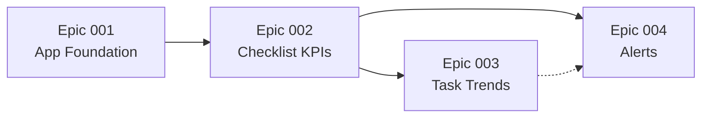

# Tasks Division — GitHub Issues

> Divisão de trabalho para o use case **International Paper — InField Challenge**.  
> Cada épico mapeia a uma pasta SDD em `specs/` e a um conjunto de **GitHub Issues** sugeridas.  
> **Requisitos:** [`APPLICATION-REQUIREMENTS.md`](APPLICATION-REQUIREMENTS.md)  
> **Protótipo:** [`../prototype/LOVABLE-PROTOTYPE.md`](../prototype/LOVABLE-PROTOTYPE.md)

**Versão:** 1.1 · **Data:** 2026-06-02

---

## Alocação do time

| Dev | Épicos (owner) | Tarefas | Perfil |
| --- | --- | --- | --- |
| **Guilherme** | 001 | 13 | Plataforma Fusion, serviços, pipelines, host-sync |
| **João** | 002 | 13 | Overview, detalhe, CRUD alerts, dashboards analíticos |
| **Caio** | 003, 004 | 13 | Shell UI, listas/filtros, time-series, wizard alerts |

Detalhe por tarefa: coluna `@Dev` em cada `specs/<NNN>/tasks.md`.

**GitHub logins (assignee):**

| Dev | GitHub | Épicos |
| --- | --- | --- |
| João | [`joaomacedx`](https://github.com/joaomacedx) | 002 |
| Guilherme | *assign manual no GitHub* · `guilhermersantiago@gmail.com` | 001 |
| Caio | [`LandimRadix`](https://github.com/LandimRadix) | 003, 004 |

**Criar issues no repo:** [`scripts/create-github-issues.ps1`](../../scripts/create-github-issues.ps1)

```powershell
$env:GH_TOKEN = "ghp_..."                    # ver abaixo onde criar PAT
./scripts/create-github-issues.ps1           # assignees omitidos por padrao
```

Gera 24 issues (4 épicos + 20 sub-issues) e [`GITHUB-ISSUES-CREATED.md`](GITHUB-ISSUES-CREATED.md) com URLs.

**Artefatos SDD por feature (fluxo completo):** `spec.md` + `research.md` + `plan.md` + `tasks.md` + `progress.md`.

---

## Ordem de implementação recomendada



| Ordem | Épico | Motivo |
| --- | --- | --- |
| 1 | **001 — App Foundation** | Fusion, shell IP, host-sync — prerequisite de tudo |
| 2 | 002 — Checklist KPIs | Dados, overview, listagem, drill-down |
| 3 | 003 — Task Result Trends | Depende de task results expostos em 002 |
| 4 | 004 — Alerts & Notifications | Triggers consomem eventos de status/resultado (002/003) |

---

## Labels sugeridas (GitHub)

| Label | Uso |
| --- | --- |
| `epic` | Issue pai agrupadora |
| `feature/001-foundation` | App foundation & Fusion shell |
| `feature/002-kpis` | Checklist KPIs |
| `feature/003-trends` | Task result trends |
| `feature/004-alerts` | Alerts & notifications |
| `type/frontend` | UI Flows + Aura |
| `type/backend` | Serviços CDF / integração |
| `type/test` | Cobertura Test-First |
| `blocked` | Dependência não resolvida |

---

## Epic 001 — App Foundation & Fusion Shell

**Spec SDD:** [`specs/001-checklist-management/spec.md`](../../specs/001-checklist-management/spec.md)  
**Tasks SDD:** [`specs/001-checklist-management/tasks.md`](../../specs/001-checklist-management/tasks.md)  
**Protótipo:** `app-sidebar.tsx`, `__root.tsx`

### Issue #EPIC-001 (épico)

**Título:** `[Epic] App Foundation & Fusion Shell — InField Challenge`  
**Descrição:** Integração Fusion/CDF, shell IP com sidebar, host-sync de navegação e remoção do welcome scaffold. Prerequisite para 002–004. AR-001…AR-006.  
**Acceptance:** FRs de `001-checklist-management/spec.md` com testes passing; 002 pode plugar views no shell.

### Sub-issues

| Issue | Título | Owner | FRs | Dependências |
| --- | --- | --- | --- | --- |
| #001-1 | `[001] Fusion bootstrap — loading, error, CogniteSdkProvider` | João | FR-001…FR-004 | — |
| #001-2 | `[001] HostAppContext + host-synced page state` | Guilherme | FR-010, FR-011 | #001-1 |
| #001-3 | `[001] AppShell + AppSidebar (Aura, IP tokens)` | Caio | FR-005…FR-009 | #001-2 |
| #001-4 | `[001] Module placeholders + remove welcome scaffold` | João + Caio | FR-012, FR-013 | #001-3 |
| #001-5 | `[001] Integration tests — shell navigation + reload state` | Guilherme | todos | #001-3, #001-4 |

---

## Epic 002 — Checklist KPI Enhancements

**Spec SDD:** [`specs/002-checklist-kpis/spec.md`](../../specs/002-checklist-kpis/spec.md)  
**Tasks SDD:** [`specs/002-checklist-kpis/tasks.md`](../../specs/002-checklist-kpis/tasks.md)  
**Protótipo:** `/`, `/checklists`, `/checklists/:id`

### Issue #EPIC-002 (épico)

**Título:** `[Epic] Checklist KPIs & Overview — InField Challenge`  
**Descrição:** Implementar KPIs de status (To Do, Ongoing, Done, Overdue, Not OK), overview operacional, busca/filtros e detalhe de checklist conforme AR-101–AR-107.  
**Acceptance:** Todos os FRs de `002-checklist-kpis/spec.md` com testes passing.

### Sub-issues

| Issue | Título | Owner | FRs | Dependências |
| --- | --- | --- | --- | --- |
| #002-1 | `[002] Data layer — ChecklistService + status aggregation` | Guilherme | FR-001, FR-002 | #001-3, CDF views |
| #002-2 | `[002] Overview page — KPI cards + status charts` | João | FR-003, FR-004, FR-005 | #002-1 |
| #002-3 | `[002] Checklist list — search, filters, sort, host-sync` | Caio | FR-006, FR-007, FR-008 | #002-1 |
| #002-4 | `[002] Checklist detail — task results table` | João | FR-009, FR-010 | #002-1 |
| #002-5 | `[002] Overview view plug-in no AppShell` | João | FR-003…FR-005 | #001-3, #002-2 |
| #002-6 | `[002] Integration tests — overview + list + detail` | Caio | todos | #002-2 … #002-4 |

---

## Epic 003 — Task Result Dashboards

**Spec SDD:** [`specs/003-task-result-trends/spec.md`](../../specs/003-task-result-trends/spec.md)  
**Tasks SDD:** [`specs/003-task-result-trends/tasks.md`](../../specs/003-task-result-trends/tasks.md)  
**Protótipo:** `/task-results`, `/kpis`

### Issue #EPIC-003 (épico)

**Título:** `[Epic] Task Result Trends & Analytics — InField Challenge`  
**Descrição:** Dashboards OK vs Not OK e KPIs temporais conforme AR-201–AR-205.  
**Acceptance:** FRs de `003-task-result-trends/spec.md` com testes passing.

### Sub-issues

| Issue | Título | Owner | FRs | Dependências |
| --- | --- | --- | --- | --- |
| #003-1 | `[003] TaskResultService — aggregates OK/Not OK` | Guilherme | FR-001, FR-002 | #002-1 |
| #003-2 | `[003] Task Results dashboard — breakdown charts` | João | FR-003, FR-004, FR-005 | #003-1 |
| #003-3 | `[003] Time-series KPIs — period selector + trend charts` | Caio | FR-006, FR-007, FR-008 | #003-1 |
| #003-4 | `[003] Recurring Not OK analysis` | João | FR-009 | #003-1 |
| #003-5 | `[003] Integration tests — analytics views` | Caio | todos | #003-2, #003-3 |

---

## Epic 004 — Alerts & Notifications

**Spec SDD:** [`specs/004-alerts-notifications/spec.md`](../../specs/004-alerts-notifications/spec.md)  
**Tasks SDD:** [`specs/004-alerts-notifications/tasks.md`](../../specs/004-alerts-notifications/tasks.md)  
**Protótipo:** `/alerts`

### Issue #EPIC-004 (épico)

**Título:** `[Epic] Alerts & Notifications — InField Challenge`  
**Descrição:** Regras automatizadas e configuráveis para Not OK, completed, overdue conforme AR-301–AR-310.  
**Acceptance:** FRs de `004-alerts-notifications/spec.md` com testes passing.

### Sub-issues

| Issue | Título | Owner | FRs | Dependências |
| --- | --- | --- | --- | --- |
| #004-1 | `[004] AlertRule model + AlertRuleService (CRUD)` | João | FR-001, FR-002 | — |
| #004-2 | `[004] Alerts UI — rules table + create/edit wizard` | João + Caio | FR-003, FR-004, FR-005 | #004-1 |
| #004-3 | `[004] Notification dispatcher — trigger evaluation` | Guilherme | FR-006, FR-007, FR-008 | #004-1, #002-1 |
| #004-4 | `[004] Channel adapters (email/Teams stub or integration)` | Caio | FR-009 | #004-3 |
| #004-5 | `[004] Integration tests — rule CRUD + trigger flow` | Guilherme | todos | #004-2, #004-3 |

---

## Issue template (copiar ao criar no GitHub)

```markdown
## Spec
- SDD: specs/NNN-slug/spec.md
- Research: specs/NNN-slug/research.md
- Plan: specs/NNN-slug/plan.md
- Tasks: specs/NNN-slug/tasks.md
- Prototype: docs/prototype/LOVABLE-PROTOTYPE.md

## Assignee
- @João / @Guilherme / @Caio

## Functional Requirements
- FR-xxx: ...

## Acceptance
- [ ] Testes Test-First passing
- [ ] Matriz FR→teste atualizada em progress.md
- [ ] flows-code-review / flows-design-review quando aplicável

## Dependencies
- Blocks: #
- Blocked by: #
```

---

## Checklist ao abrir sprint

- [ ] Épico criado com link para `specs/NNN-*/spec.md`
- [ ] Sub-issues referenciam FRs específicos
- [ ] `specs/README.md` atualizado com status `in-progress`
- [ ] DoR de `CONSTITUTION.md` satisfeito antes de codar
- [ ] Protótipo Lovable consultado para layout (traduzir para Aura)

---

## Referência cruzada specs ↔ issues

| Spec folder | Épico GitHub | Application Requirements |
| --- | --- | --- |
| `001-checklist-management` | EPIC-001 | AR-001 … AR-006 |
| `002-checklist-kpis` | EPIC-002 | AR-101 … AR-107 |
| `003-task-result-trends` | EPIC-003 | AR-201 … AR-205 |
| `004-alerts-notifications` | EPIC-004 | AR-301 … AR-310 |
